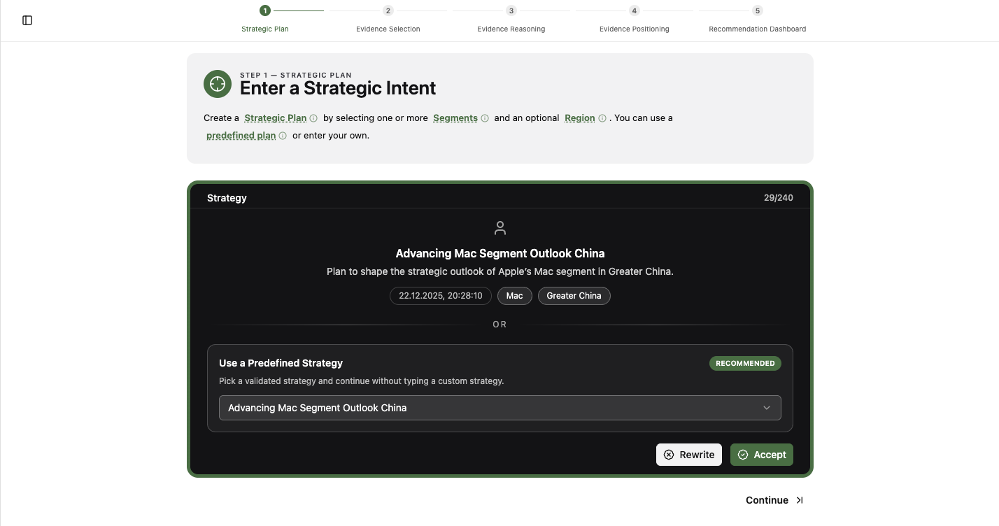
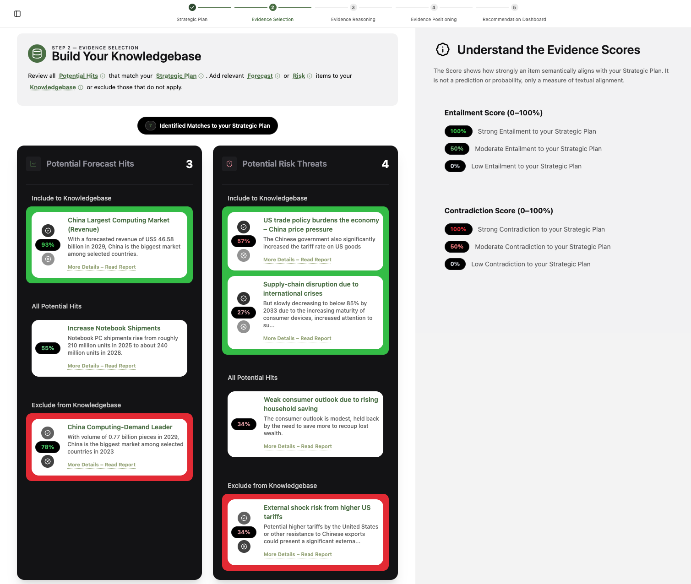
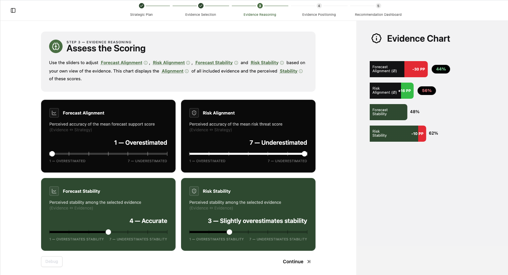
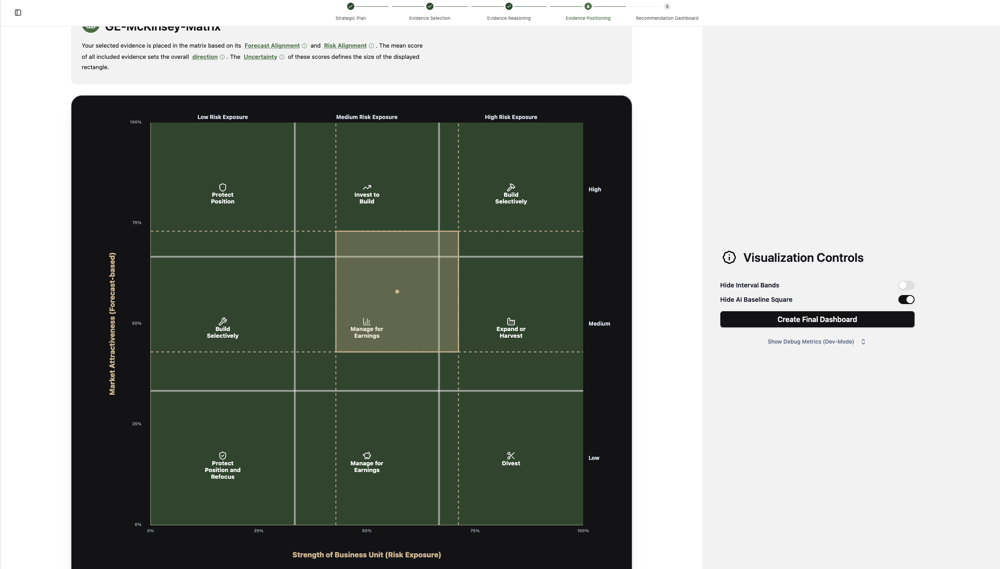
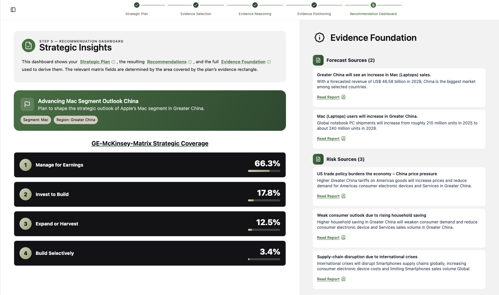
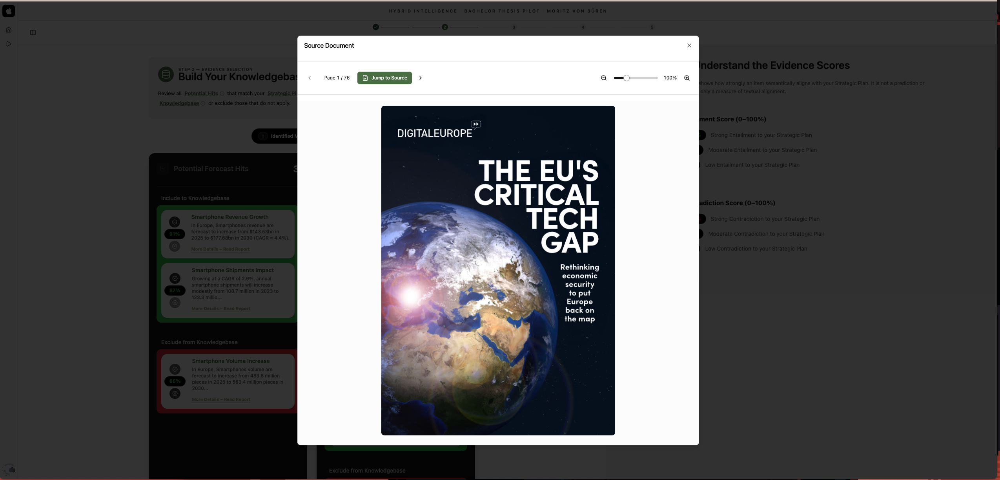

<!-- PROJECT LOGO -->
<br />
<div align="center">
  
  <h1 align="center">Development of a Hybrid Intelligence Decision Support System for Strategic Planning Support</h1>
  <a href="https://hybridintelligence.dev/">
    
  </a>
  <p align="center">
    Hybrid Intelligence Decision Support System for evidence-based strategic planning under information overload and uncertain signals.
    <br />
    It evaluates strategic plans against a transparent, traceable evidence base, integrates human strategic judgment throughout the workflow, and prepares results for strategic assessment.
  </p>
</div>

<!-- TABLE OF CONTENTS -->
<details>
  <summary>Table of Contents</summary>
  <ol>
    <li><a href="#overview">Overview</a></li>
    <li><a href="#technical-innovation">Technical innovation</a></li>
    <li><a href="#built-with">Built With</a></li>
    <li><a href="#workflow-screenshots">Workflow screenshots</a></li>
    <li><a href="#frontend">Frontend</a></li>
    <li><a href="#backend">Backend</a></li>
    <li><a href="#additional-docs">Additional docs</a></li>
  </ol>
</details>

---

## Overview

The system pairs a multi-step frontend workflow with a FastAPI backend that manages strategy stages, evidence scoring, and NLI outputs.

## Technical innovation

**Design Objectives (Hevner et al., 2004)**

![1][Tech-01] ![Extends strategic instrument with HI][Tech-01-Text]

![2][Tech-02] ![Hybrid reasoning with clear roles][Tech-02-Text]

![3][Tech-03] ![Multi dimensional assessment signals][Tech-03-Text]

![4][Tech-04] ![Traceable approval gated evidence][Tech-04-Text]

![5][Tech-05] ![Hybrid uncertainty visualization][Tech-05-Text]

## Built With

### Frontend

- [![React][React-badge]][React-url]
- [![Vite][Vite-badge]][Vite-url]
- [![TypeScript][TypeScript-badge]][TypeScript-url]
- [![Tailwind][Tailwind-badge]][Tailwind-url]
- [![Radix][Radix-badge]][Radix-url]
- [![shadcn/ui][ShadcnUi-badge]][ShadcnUi-url]
- [![shadcn.io][ShadcnIo-badge]][ShadcnIo-url]
- [![Lucide][Lucide-badge]][Lucide-url]
- [![Recharts][Recharts-badge]][Recharts-url]
- [![PDFjs][PDFjs-badge]][PDFjs-url]
- [![ReactRouter][ReactRouter-badge]][ReactRouter-url]

### Backend

- [![Python][Python-badge]][Python-url]
- [![FastAPI][FastAPI-badge]][FastAPI-url]
- [![FAISS][FAISS-badge]][FAISS-url]
- [![NumPy][NumPy-badge]][NumPy-url]
- [![Pandas][Pandas-badge]][Pandas-url]
- [![PyTorch][PyTorch-badge]][PyTorch-url]
- [![Transformers][Transformers-badge]][Transformers-url]
- [![NLI Model][NLI-badge]][NLI-url]
- [![Embedding Model][OpenAIEmbedding-badge]][OpenAIEmbedding-url]

## Workflow screenshots

### Step 1 - Strategic Plan

Define the strategic intent, segment, and region, or select a predefined plan.



### Step 2 - Evidence Selection

Curate the knowledgebase by including or excluding evidence, with score guidance.



### Step 3 - Evidence Reasoning

Adjust alignment and stability sliders to reflect the evidence signal.



### Step 4 - Evidence Positioning

Place evidence in the GE-McKinsey matrix and refine the final position.



### Step 5 - Recommendation Dashboard

Review strategic insights and the evidence foundation behind the recommendation.



### Feature detail

Source document viewer for evidence traceability and report inspection.



## Frontend

React + Vite frontend for the Hybrid Intelligence Decision Support system.
Focus: multi-step evaluation workflow, evidence curation, and visualization.

### Local run

Requirement: Node.js >= 18

```bash
npm install
npm run dev
```

### Project structure

```text
.
|-- public/              # static assets
|-- src/
|   |-- main.tsx         # React root, router, providers
|   |-- router/          # route definitions
|   |-- pages/           # screen-level routes
|   |-- layouts/         # app layout shells
|   |-- components/      # shared UI components
|   |-- features/        # workflow features (charts, selection, pdf)
|   |-- data/            # datasets and matrix presets
|   |-- lib/             # API client, helpers
|   |-- hooks/           # UI hooks
|   |-- styles/          # Tailwind entrypoint
|   `-- types/           # type declarations
|-- index.html
|-- package.json
|-- vite.config.ts
|-- tailwind.config.js
|-- tsconfig*.json
`-- vercel.json
```

Each top-level folder represents a system responsibility.

### Architecture

#### Workflow view

```text
+====================================================================+
||......................:: 1-Strategic Plan ::......................||
||                                                                  ||
||                        strategic-plan.tsx                        ||
||                                                                  ||
+====================================================================+
                                   v
+====================================================================+
||....................:: 2-Evidence Selection ::....................||
||                                                                  ||
||     evidence-selection-loading.tsx -> evidence-selection.tsx      ||
||                                                                  ||
+====================================================================+
                                   v
+====================================================================+
||....................:: 3-Evidence Reasoning ::....................||
||                                                                  ||
||                      evidence-reasoning.tsx                      ||
||                                                                  ||
+====================================================================+
                                   v
+====================================================================+
||...................:: 4-Evidence Positioning ::...................||
||                                                                  ||
||   evidence-positioning-loading.tsx -> evidence-positioning.tsx    ||
||                                                                  ||
+====================================================================+
                                   v
+====================================================================+
||.................:: 5-Recommendation Dashboard ::.................||
||                                                                  ||
||                   recommendation-dashboard.tsx                   ||
||                                                                  ||
+====================================================================+
```

### API

App entry point:

```text
http://127.0.0.1:5173
```

Examples:

```bash
http://127.0.0.1:5173/login
http://127.0.0.1:5173/strategic-plan
http://127.0.0.1:5173/dashboard
```

## Backend

FastAPI backend for the Hybrid Intelligence Decision Support system.
Focus: orchestrating strategy workflows, NLI stages, and scoring via HTTP.

### Local run

Requirement: Python >= 3.12

```bash
python -m venv .venv
source .venv/bin/activate

python -m pip install --upgrade pip poetry
poetry install

poetry run serve
```

### Project structure

```text
.
|-- app/
|   |-- __main__.py        # uvicorn entry point
|   |-- main.py            # app factory, CORS, health
|   |-- api/               # HTTP routes (v1)
|   |-- modules/           # hybrid services and schemas
|   |-- pipelines/         # NLI stage scripts
|   |-- infrastructure/    # paths, persistence, presets
|   |-- config/            # settings
|   |-- scripts/           # CLI helpers
|   `-- data/              # default data/workdir root
|-- pyproject.toml
|-- poetry.lock
|-- pytest.ini
`-- README.md
```

Each top-level folder represents a system responsibility.

### Architecture

#### Stages view

```text
+====================================================================+
||..................:: Preprocessing artifacts ::...................||
+====================================================================+
                                   v
+====================================================================+
||........................:: 2-Hypothesen ::........................||
||                                                                  ||
||                      strategy_hypotheses.py                      ||
||                                                                  ||
+====================================================================+
                                   v
+====================================================================+
||........................:: 3-Embeddings ::........................||
||                                                                  ||
||                 forecast-reports | risk-reports                  ||
||                                                                  ||
+====================================================================+
                                   v
+====================================================================+
||.......................:: 4-PremisePairs ::.......................||
||                                                                  ||
||                 forecast-reports | risk-reports                  ||
||                                                                  ||
+====================================================================+
                                   v
+====================================================================+
||.........................:: 5-Reports ::..........................||
||                                                                  ||
||                          merge_pairs.py                          ||
||                                                                  ||
+====================================================================+
                                   v
+====================================================================+
||........................:: 6-UserReview ::........................||
||                                                                  ||
||                        add_user_status.py                        ||
||                                                                  ||
+====================================================================+
                                   v
+====================================================================+
||.........................:: 7-Scoring ::..........................||
||                                                                  ||
||                 score_summary.py | intervall.py                  ||
||                                                                  ||
+====================================================================+
                                   v
+====================================================================+
||.....................:: 8-HumanKalibration ::.....................||
||                                                                  ||
||                       human_calibration.py                       ||
||                                                                  ||
+====================================================================+
                                   v
+====================================================================+
||.........................:: 9-Strategy ::.........................||
||                                                                  ||
||                     compute_distribution.py                      ||
||                                                                  ||
+====================================================================+
```

### Responsibilities

- API layer: FastAPI app, v1 router, health endpoints.
- Service layer: modules/hybrid/services orchestrate workflow state and stage execution.
- Stages: app/pipelines/nli scripts for retrieval, NLI pairing, reports, scoring.
- State handling: workdir files under NLI_DATA_ROOT/NLI_WORKDIR and presets in PRESETS_DIR.
- Configuration: pydantic-settings loads .env and environment variables.

### Configuration

Environment variables are loaded from `.env` in the repository root (if present).

| Name | Responsibility | Default |
|------|---------------|---------|
| APP_HOST | Bind address | `127.0.0.1` |
| APP_PORT | HTTP port | `8000` |
| APP_RELOAD | Auto reload | `false` |
| FRONTEND_ORIGINS | CORS allowlist | `http://localhost:5173, https://hybridintelligence.dev` |
| OPENAI_API_KEY | OpenAI API key for stage scripts | `unset` |
| NLI_DATA_ROOT | Base data directory | `app/data/nli` |
| NLI_WORKDIR | Stages workdir | `NLI_DATA_ROOT/workdir` |
| PRESETS_DIR | Preset files | `presets` |
| NLI_MODEL_NAME | Local NLI model | `microsoft/deberta-large-mnli` |

### API

OpenAPI schema:

```text
http://127.0.0.1:8000/openapi.json
```

Examples:

```bash
curl http://127.0.0.1:8000/health
curl http://127.0.0.1:8000/hybrid/pipeline/status
```

## Additional docs

- `frontend/docs_frontend.md`
- `backend/docs_backend.md`

<!-- MARKDOWN LINKS & IMAGES -->
[React-badge]: https://img.shields.io/badge/React-61DAFB?style=for-the-badge&logo=react&logoColor=000000
[React-url]: https://react.dev/
[Vite-badge]: https://img.shields.io/badge/Vite-646CFF?style=for-the-badge&logo=vite&logoColor=white
[Vite-url]: https://vitejs.dev/
[TypeScript-badge]: https://img.shields.io/badge/TypeScript-3178C6?style=for-the-badge&logo=typescript&logoColor=white
[TypeScript-url]: https://www.typescriptlang.org/
[Tailwind-badge]: https://img.shields.io/badge/Tailwind%20CSS-38B2AC?style=for-the-badge&logo=tailwindcss&logoColor=white
[Tailwind-url]: https://tailwindcss.com/
[Radix-badge]: https://img.shields.io/badge/Radix%20UI-161618?style=for-the-badge&logo=radixui&logoColor=white
[Radix-url]: https://www.radix-ui.com/
[ShadcnUi-badge]: https://img.shields.io/badge/Component%20Library-shadcn%2Fui-000000?style=for-the-badge&labelColor=FFFFFF
[ShadcnUi-url]: https://ui.shadcn.com/
[ShadcnIo-badge]: https://img.shields.io/badge/Component%20Library-shadcn.io-000000?style=for-the-badge&labelColor=FFFFFF
[ShadcnIo-url]: https://www.shadcn.io/
[Tech-01]: https://img.shields.io/badge/-%F0%9D%9F%8F-111111?style=flat
[Tech-01-Text]: https://img.shields.io/badge/-Extends%20a%20strategic%20management%20instrument%20with%20Hybrid%20Intelligence%20beyond%20domain%20specific%20decision%20contexts-F5F5F7?style=flat
[Tech-02]: https://img.shields.io/badge/-%F0%9D%9F%90-111111?style=flat
[Tech-02-Text]: https://img.shields.io/badge/-Hybrid%20Intelligence%20architecture%20merges%20semantic%20evidence%20reasoning%20and%20human%20judgment%20with%20clear%20role%20separation-F5F5F7?style=flat
[Tech-03]: https://img.shields.io/badge/-%F0%9D%9F%91-111111?style=flat
[Tech-03-Text]: https://img.shields.io/badge/-Multi%20dimensional%20strategy%20assessment%20operationalizes%20semantic%20ratings%20as%20support%20or%20contradiction%20signals-F5F5F7?style=flat
[Tech-04]: https://img.shields.io/badge/-%F0%9D%9F%92-111111?style=flat
[Tech-04-Text]: https://img.shields.io/badge/-Traceable%20approval%20gated%20evidence%20only%20source%20bound%20citable%20passages%20enter%20decision%20support-F5F5F7?style=flat
[Tech-05]: https://img.shields.io/badge/-%F0%9D%9F%93-111111?style=flat
[Tech-05-Text]: https://img.shields.io/badge/-Hybrid%20uncertainty%20visualization%20shows%20interval%20based%20evidence%20ratings%20and%20uncertainty%20aware%20strategy%20derivation-F5F5F7?style=flat
[Recharts-badge]: https://img.shields.io/badge/Recharts-22C55E?style=for-the-badge
[Recharts-url]: https://recharts.org/en-US/
[PDFjs-badge]: https://img.shields.io/badge/PDF.js-FF5722?style=for-the-badge&logo=adobeacrobatreader&logoColor=white
[PDFjs-url]: https://mozilla.github.io/pdf.js/
[ReactRouter-badge]: https://img.shields.io/badge/React%20Router-CA4245?style=for-the-badge&logo=reactrouter&logoColor=white
[ReactRouter-url]: https://reactrouter.com/
[Lucide-badge]: https://img.shields.io/badge/Lucide-000000?style=for-the-badge&logo=lucide&logoColor=white
[Lucide-url]: https://lucide.dev/
[Python-badge]: https://img.shields.io/badge/Python-3.12-3776AB?style=for-the-badge&logo=python&logoColor=white
[Python-url]: https://www.python.org/
[FastAPI-badge]: https://img.shields.io/badge/FastAPI-009688?style=for-the-badge&logo=fastapi&logoColor=white
[FastAPI-url]: https://fastapi.tiangolo.com/
[FAISS-badge]: https://img.shields.io/badge/FAISS-0866FF?style=for-the-badge&logo=meta&logoColor=white
[FAISS-url]: https://github.com/facebookresearch/faiss
[Transformers-badge]: https://img.shields.io/badge/Transformers-HuggingFace-FFD21E?style=for-the-badge&logo=huggingface&logoColor=000000&labelColor=FFFFFF
[Transformers-url]: https://huggingface.co/docs/transformers/
[PyTorch-badge]: https://img.shields.io/badge/PyTorch-EE4C2C?style=for-the-badge&logo=pytorch&logoColor=white
[PyTorch-url]: https://pytorch.org/
[NumPy-badge]: https://img.shields.io/badge/NumPy-013243?style=for-the-badge&logo=numpy&logoColor=white
[NumPy-url]: https://numpy.org/
[Pandas-badge]: https://img.shields.io/badge/Pandas-150458?style=for-the-badge&logo=pandas&logoColor=white
[Pandas-url]: https://pandas.pydata.org/
[NLI-badge]: https://img.shields.io/badge/NLI%20Model-microsoft%2Fdeberta--large--mnli-FFD21E?style=for-the-badge&logo=huggingface&logoColor=000000&labelColor=FFFFFF
[NLI-url]: https://huggingface.co/microsoft/deberta-large-mnli
[OpenAIEmbedding-badge]: https://img.shields.io/badge/Embedding%20Model-text--embedding--3--small-10A37F?style=for-the-badge&labelColor=FFFFFF
[OpenAIEmbedding-url]: https://platform.openai.com/
